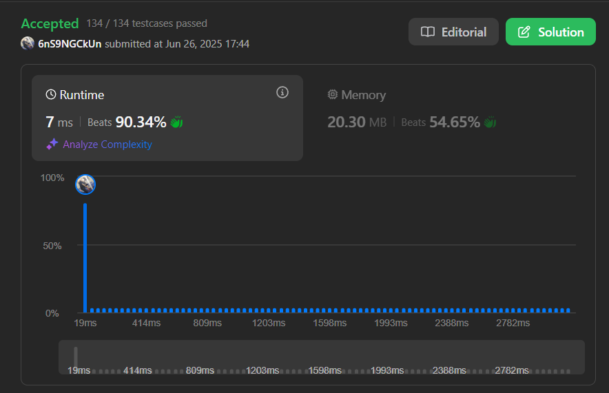
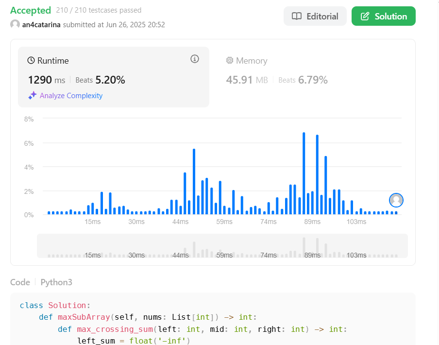

# Dividir e Conquistar

**Número da Lista**: 44

**Conteúdo da Disciplina**: FGA0124 - PROJETO DE ALGORITMOS - T01  

## Alunos

<table>
  <tr>
    <td><a href="https://github.com/an4catarina"> <b>Ana Catarina</b></a> </td>
    <td><a href="https://github.com/ViictorHugoo"> <b>Victor Hugo</b></a> </td>
  </tr>
</table>

| Matrícula   | Aluno                              |
| ----------- | ---------------------------------- |
| 21/1041099  | Ana Catarina Santos                |
| 21/1063256  | Victor Hugo Rodrigues Guimarães    |

## Sobre

Foram resolvidas três questões médias e uma questão difícil.

| Código do Problema | Nome do Problema | Dificuldade |
| ------------------ | ---------------- | ----------- |
| 23 | [Merge k Sorted Lists](https://leetcode.com/problems/merge-k-sorted-lists/description/) | Difícil |
| | | Difícil |
|53 | [Maximum Subarray](https://leetcode.com/problems/maximum-subarray/description/) | Média |
| | | Média |

### Difíceis

#### 23 - Merge k Sorted Lists

[Link para submissão](https://leetcode.com/problems/merge-k-sorted-lists/submissions/1677669575/)

#### 

[Link para submissão]()

### Médias

#### 

[Link para submissão](https://leetcode.com/problems/maximum-subarray/submissions/1677744890)

#### 

#### 

[Link para submissão]()

## Explicação dos algoritmos

[Apresentação - Explicação dos Algoritmos]()

## Instalação

**Linguagem**: Python.

## Uso 

Para testar os códigos, basta entrar na plataforma [LeetCode](https://leetcode.com/), procurar pelos exercícios e colar na aba Code.

